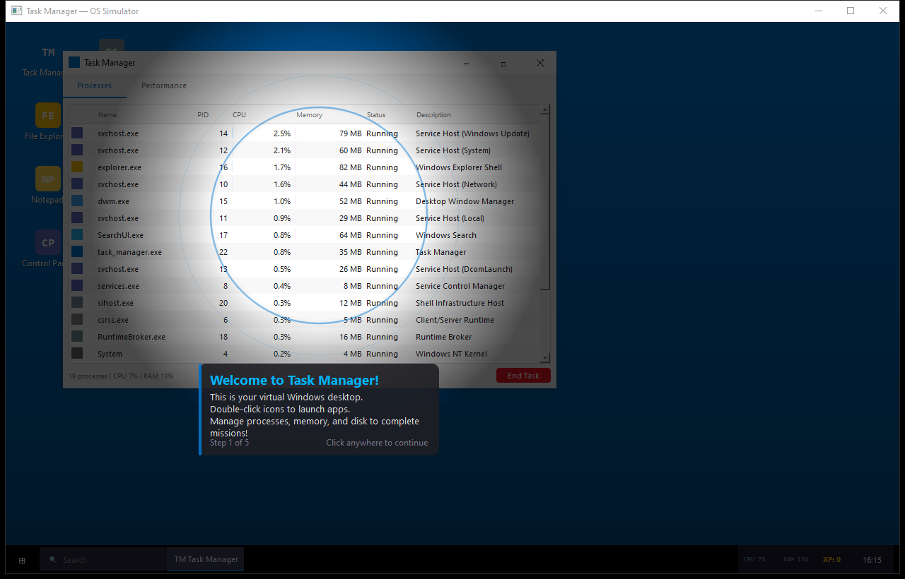

# Task Manager — OS Simulator Game

**A fake Windows desktop where you manage virtual processes, memory, and disk. Missions teach you how operating systems work — by playing.**

Built with PyQt5. Looks like Windows 10. Runs like a game. Teaches like a classroom.

[](https://lozturner.github.io/task-manager-game)
[](LICENSE)
[](https://python.org)

---

## What Is This?

Task Manager is an OS simulator game. You get a virtual Windows desktop with a taskbar, start menu, and draggable windows. Under the hood, a virtual kernel runs ~18 processes that fluctuate CPU and RAM in real-time. Missions appear — kill a runaway process, free memory, find malware, optimise startup services — and you earn XP.



---

## Three Editions

### Community Edition
For the general populace. Download, run, play. A sandbox to experiment with OS concepts without breaking anything real. Want to know what happens when you kill `svchost.exe`? Find out here, not on your actual machine.

### Fun Edition
Gamified chaos. Random malware injections, memory leaks, Windows Update hogging resources. Compete for high scores. Speed-run missions. The XP/level system unlocks more CPU cores and RAM as you progress.

### Education Edition (Key Stage 2+)
Designed for classrooms. The generation growing up above the AI layer still needs to understand what's underneath — processes, memory, binary, how an OS actually works. This edition is structured around curriculum-aligned missions:

- **KS2 (Ages 7-11):** What is a process? What is memory? Why does the computer slow down?
- **KS3/GCSE:** Priority scheduling, memory pressure, service management, malware identification
- **Enterprise/Training:** Role-play complex scenarios. Map out system architectures. Complete a mission, get a software map ticket — take what you learned into real infrastructure planning.

> *"The 90s tech is fading from memory. Binary is still in our lives. This bridges the gap."*

---

## Screenshots

The game presents a full Windows 10-style desktop:

- **Desktop** with clickable icons and a wallpaper gradient
- **Taskbar** with Start button, running apps, CPU/RAM/XP indicators, and a clock
- **Task Manager** with live process list, inline progress bars, right-click context menus, and performance graphs
- **File Explorer** for managing virtual disk files
- **Control Panel** for toggling system services
- **Toast notifications** for mission alerts
- **Animated tutorial overlay** with spotlight pinhole on first launch

---

## Quick Start

### From Source
```bash
git clone https://github.com/lozturner/task-manager-game.git
cd task-manager-game
pip install -r requirements.txt
python Laurence_TaskManager_launcher.py
```

### From EXE (Windows)
Download `Laurence_TaskManager_v1.0.0.exe` from [Releases](https://github.com/lozturner/task-manager-game/releases) and double-click.

---

## Architecture

```
winsim/
    winsim_main.py          Entry point, QApplication, game loop
    os_kernel.py            Virtual OS (processes, memory, disk) — pure Python
    game_engine.py          Missions, scoring, events, save/load
    missions.py             Mission definitions (data-driven dicts)
    skins.py                Win10 theme (colours, fonts)
    widgets.py              PerfGraph, ToastNotification, TutorialOverlay
    desktop.py              Desktop surface + icons
    taskbar.py              Taskbar + Start menu + system tray
    window_manager.py       Draggable GameWindow with Win10 chrome
    apps/
        task_manager.py     Virtual Task Manager (gameplay centrepiece)
        file_explorer.py    Virtual file browser
        notepad.py          Virtual text editor
        control_panel.py    Virtual services manager
```

**Three layers:**
1. **Virtual OS Kernel** (`os_kernel.py`) — pure Python, no Qt. Processes tick every 500ms with CPU/RAM fluctuation, malware growth, memory pressure.
2. **Game Engine** (`game_engine.py`) — QObject with signals. Missions, XP, levels, random events (memory leaks, malware injection, Windows Update hogging).
3. **UI** — PyQt5 fake Windows 10 desktop. Taskbar, start menu, draggable windows, toast notifications.

---

## Mission Types

| Mission | What You Do | XP |
|---------|-------------|-----|
| Launch an App | Open Notepad from the desktop | 10 |
| Runaway Process | Find and kill a CPU hog | 25 |
| Memory Pressure | Free 200+ MB by killing processes | 30 |
| Suspicious Activity | Identify and terminate malware | 40 |
| Slow Boot | Disable 2+ non-essential services | 35 |
| Disk Almost Full | Delete temp files to free 300+ MB | 20 |
| Laggy Video Call | Set a process to High priority | 30 |

---

## Contributing

This is an open project. PRs welcome. Here's what's on the roadmap:

- [ ] Windows 7 retro skin
- [ ] BSOD game-over screen
- [ ] Virtual Command Prompt
- [ ] Network simulation (ping, DNS, firewall)
- [ ] Achievement system
- [ ] Sound effects
- [ ] Tutorial wizard for Education Edition
- [ ] Curriculum-mapped mission packs (KS2, KS3, GCSE)
- [ ] Multiplayer scoreboard
- [ ] Linux skin variant

### How to Contribute
1. Fork the repo
2. Create a feature branch (`git checkout -b feature/bsod-screen`)
3. Commit your changes
4. Push and open a PR

---

## Tech Stack

- **Python 3.11+**
- **PyQt5** — UI framework
- **psutil** — (DevSpy integration only)
- **pywin32** — (DevSpy integration only)
- **PyInstaller** — exe packaging

---

## License

MIT License. See [LICENSE](LICENSE).

---

## Credits

Created by **Laurence Turner** ([@lozturner](https://github.com/lozturner))

Built with Claude Code.
